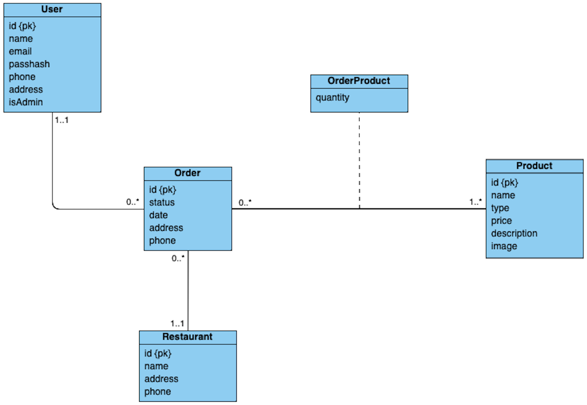
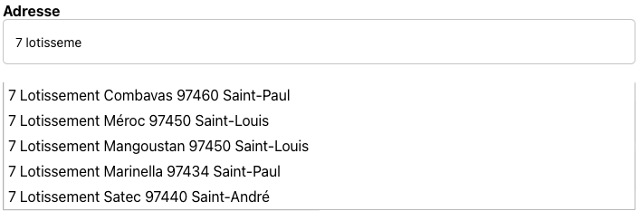
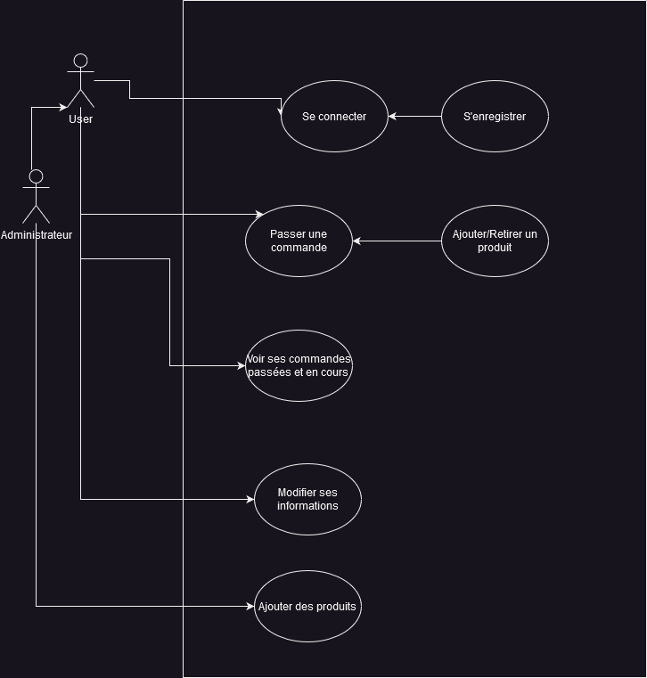
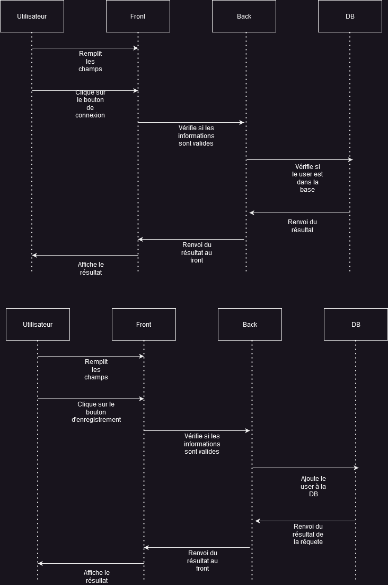
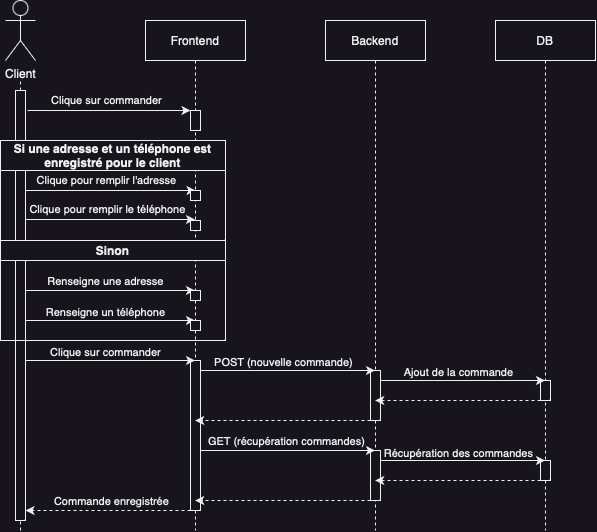
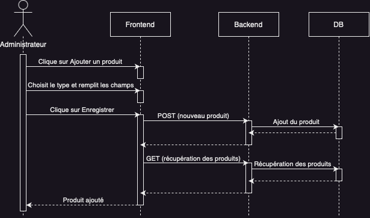

# Documentation du projet

#### Comptes disponibles pour tester l'application

Des comptes sont disponibles dans la base de données pour commencer à tester l'application sans avoir à créer de comptes :

- Compte administrateur : **Mail :** *admin@gmail.com* **Mot de passe :** *admin*

- Compte client : **Mail :** *test@gmail.com* **Mot de passe :** *test*

Vous pourrez créer des comptes clients depuis l'application mais pas de compte administrateur.

## Objectifs du projet et présentation de l'application

Le but du projet était de développer une application en Node/Express (backend) et ReactNative (frontend), comprenant la gestion de rôles avec des utilisateurs différents ayant des droits différenciés, et l'utilisation d'une API externe. Le tout accompagné de la mise en place de jeux de tests côté backend et de tests fonctionnels avec la technologie Cypress côté frontend.

Pour mener à bien ce projet, nous avons décidé de développer une application de commandes en ligne pour le restaurant FKH (La Fabrik de l'Hambourgeois). L'application comprend 4 pages et est inspirée de ce que peuvent proposer des applications telles que Uber Eats ou Deliveroo. On retrouve une page d'accueil listant l'ensemble des produits regroupés par catégorie (Burgers, Boissons, Frites), une page Panier où l'on peut passer commande, une page commande regroupant toutes les commandes terminées et en cours, et une page regroupant les informations modifiables de l'utilisateur.

## Modèle de données

La base de données est composée des tables User, Order, Product, OrderProduct et Restaurant.

**User :** un utilisateur est identifié par un *id* unique. Son email doit également être unique à la création. Et seuls les champs *name*, *email*, *passhash* et *isAdmin* sont requis.

**Order :** la table Order contient l'ensemble des commandes. Une commande est identifiée par un *id* unique. L'ensemble des champs sont obligatoires. Le champs *status* est un booléen qui permet de savoir si la commande a été livrée (true) ou non (false).

**Product :** la table Product contient l'ensemble des produits. Un produit est identifié par un *id* unique. Seuls les champs description et image ne sont pas obligatoires. A noter que l'image est stockée comme une chaîne de caractères. Il faut donc renseigner une url d'une image en ligne.

**OrderProduct :** cette table permet de faire l'association entre une commande et les produits qui la composent. Elle permet de maintenir la quantité de chaque produit dans la commande.

**Restaurant :** cette table contient l'ensemble des points de vente de la chaîne de restaurants FKH. Pour le moment, nous n'avons qu'un unique restaurant dans la base. Ainsi toutes les commandes passées sont automatiquement liées à ce restaurant.

## Documentation de l'API côté backend

La documentation est disponible ici : https://fkh-resto.osc-fr1.scalingo.io/doc.

## Choix techniques

### Base de données

La base de données est hébergée sur sqlite. La configuration initiale se trouve dans **backendsqlite/src/util/initdb.js**

### Backend

Pour le backend, nous avons opté pour une architecture MVC (Modèle-Vue-Contrôleur). Nous avons identifié les entités suivantes :

- Users (utilisateurs)
- Orders (commandes)
- Restaurant (restaurant)
- Product (produit)

### Frontend

1. Organisation du code :

   - Découpage en plusieurs composantes correspondant à des pages dans **/src/components** :

     - Homepage (Page d'accueil avec la liste de produits)
     - Commandes
     - Utilisateurs
     - Panier

   - Des composantes réutilisables dans **src/commons**
   - Les fonctions utiles et les appels à l'API dans **src/services**
   - Redux store dans **src/store**

2. Utilisation de Redux toolkit pour la gestion des états dans **/src/store**. Le store est composé de 3 slices :

   - **userSlice** : gère l'état de l'utilisateur connecté
   - **cartSlice** : gère l'état du panier
   - **appDataSlice** : gère l'état des données de l'application (produits, commandes, restaurants)
   - **messageSlice**: gère l'état des messages gloabaux de l'application

3. Système global de messages : les messages sont stockés dans le store et sont affichés dans le composant **Messages** à la racine de l'application.

### Webservice

Nous avions prévu d'utiliser une API externe permettant de calculer le nombre de calories dans les différents produits proposés. L'API en question : https://api-ninjas.com/api/nutrition

Par manque de temps, nous avons décidé d'opter pour une API d'autocomplétion des adresses postales, utilisée lorsque l'utilisateur modifie son adresse depuis la page des informations utilisateurs. Nous avions deux options :

- L'API Google Places. Le problème : l'API nécessite une clé payante.

- L'API du gouvernement Français https://adresse.data.gouv.fr/api-doc/adresse. Cette dernière ne nécessite pas de clé et le nombre de requêtes est illimité. Cette donc celle-ci que nous avons utilisé.

L'appel à l'API se fait depuis la fonction *autocompleteAddress* du fichier **frontend/src/services/data.service.ts**. Cette fonction est appelée dans le composant **frontend/src/components/UserInfos.tsx** dès lors que l'utilisateur a entré plus de 3 caractères dans le champ Adresse. Le retour de l'appel est parsé dans le composant pour former une liste d'adresses affichées et cliquables pour remplir le champ.

### Gestion des rôles

Dans notre application, nous avons défini deux rôles : **admin** et **user**.

Selon la valeur de la variable **isAdmin**, différents affichages sont proposés pour ces deux rôles. Par exemple, sur la page d'un produit, un **admin** aura accès à des boutons lui permettant de modifier ou de supprimer le produit, tandis qu'un **user** ne verra pas ces options. De plus, la page **Panier** ne sera pas affichée pour un **admin**.
| | User | Admin |
| ----------------- | -------------------------------------------------------- | ------------------------------------------ |
| Homepage | Ajouter le produit | Modifier/ supprimer un produit |
| Panier | Gestion de produits dans le panier et passer un commande | Pas de page panier |
| Commandes Page | Affichage et gestion de ses commandes | Affichage et gestion de tous les commandes |
| Utilisateurs Page | Modification de son profil | Modification de son profil |

### Cas d'usages

### Diagrammes de séquences 

#### Login et Register

#### Passer une commande

**Prérequis :** le client a ajouté des produits au panier et se trouve sur la page panier.

#### Ajouter un produit

**Prérequis :** l'utilisateur est administrateur et se trouve sur la page d'accueil qui regroupe les produits.

## Installation

**Backend :**

- cd backend

Installation :

- npm install

Réinitialiser la base :

- npm run updatedb

Générer la documentation :

- npm run doc

Faire les trois actions précédentes en une seule commande :

- npm run setup

Lancement :

- npm run startdev (pas de réinitialisation de la base)
OU
- npm start (réinitialisation de la base)

Lancer les tests :

- npm test

**Frontend :**

- cd frontend

Installation :

- npm install

Lancement :

- npm start (correspond à 'npx expo start')
OU
- npx expo start --tunnel (pour y accéder sans être sur le même réseau)

Lancer les tests :

- npm test

**Pour installer l'intégralité de l'application depuis la racine :**

- npm install

**Lancement de l'intégralité des tests depuis la racine :**

- npm test
- npm lint

### Demo en vidéo 

Démo Navigateur : https://www.youtube.com/watch?v=rKsrn73_Eio
Démo Iphone : https://www.youtube.com/watch?v=Maz3p864JxI
